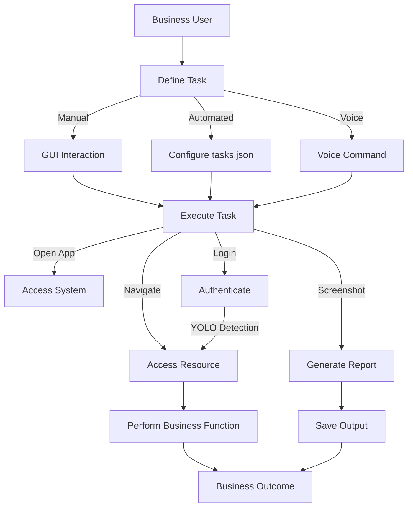

# AI Desktop Mentor

AI Desktop Mentor is an advanced Python-based desktop automation tool designed to emulate human-like interactions with a computer system. It leverages cutting-edge AI technologies, including **YOLOv8** for UI element detection, **Vosk** for offline speech recognition, and **DistilBERT** for natural language processing (NLP), to perform tasks such as opening applications, navigating websites, logging in, and processing screenshots. With a **Tkinter GUI**, it supports voice commands, task scripting, and automated workflows—ideal for business automation and personal productivity.

---

## ✨ Features

- **Automation**: Open apps (e.g., Chrome, Notepad), type text, navigate URLs, and log in to websites.
- **Screenshots**: Capture manually (`Ctrl+Shift+S`) or auto (every 15 minutes).
- **AI Navigation**: YOLOv8 detects UI elements (e.g., login fields); OCR reads screen text.
- **Task Scripting**: Execute sequences defined in `tasks.json`.
- **Voice Control**: Use offline voice commands via Vosk.
- **NLP Understanding**: Parse natural language with DistilBERT.
- **Context Awareness**: Detect CAPTCHAs/pop-ups with OCR.
- **Cross-Platform**: Works on Windows, macOS, and Linux.

---

## 📁 Directory Structure

```

AIDesktopMentor/
├── automation/
│   └── automation\_tool.py
├── config/
│   └── tasks.json
├── docs/
│   ├── README.md
│   └── requirements.txt
├── models/
│   ├── yolo\_ui\_model.pth
│   └── vosk-model-small-en-us/
├── outputs/
│   └── screenshots/
├── dataset/
│   ├── images/
│   │   ├── train/
│   │   └── val/
│   ├── labels/
│   │   ├── train/
│   │   └── val/
│   └── data.yaml

````


## 🔁 Technical Workflow

```mermaid
graph TD
    A[User Input] -->|GUI Button| B[GUI (Tkinter)]
    A -->|Voice Command| C[Voice Listener (Vosk)]
    C --> D[NLP Parser (DistilBERT)]
    D --> E[Command Processor]
    B --> E
    E -->|Open App| F[Automation Engine (PyAutoGUI)]
    E -->|Navigate URL| F
    E -->|Login| G[UI Detection (YOLOv8)]
    G --> F
    E -->|Screenshot| H[Screenshot Module]
    E -->|Read Text| I[OCR (Pytesseract)]
    E -->|Check Popups| I
    F --> J[OS Interaction]
    H --> K[Save to screenshots/]
    I --> L[Context Feedback]
    J --> M[Screen Output]
    L --> M
```

## 📊 Business Workflow



## ✅ Prerequisites

* Python **3.8+**
* Tesseract OCR

  * Windows: [Install](https://github.com/tesseract-ocr/tesseract/wiki)
  * macOS: `brew install tesseract`
  * Linux: `sudo apt-get install tesseract-ocr`
* Vosk Model

  * [Download](https://alphacephei.com/vosk/models) `vosk-model-small-en-us`
  * Extract into `models/vosk-model-small-en-us/`
* YOLO Model

  * Use `yolov8n.pt` or custom-trained model saved as `yolo_ui_model.pt`
* Python dependencies

  ```bash
  pip install -r requirements.txt
  ```
* Microphone access + Permissions (macOS/Linux screen recording/input).

---

## ⚙️ Installation

```bash
# Clone the repo
git clone https://github.com/moses000/AIDesktopMentor.git
cd AIDesktopMentor

# Set up folder structure
mkdir -p outputs/screenshots dataset/images/train dataset/images/val dataset/labels/train dataset/labels/val

# Install dependencies
pip install -r requirements.txt
```

> **Don't forget to install Tesseract OCR, Vosk model, and YOLO model.**

---

## 🧠 YOLO Setup

### Option 1: Pre-trained

```python
from ultralytics import YOLO
model = YOLO("yolov8n.pt")
```

```bash
mv yolov8n.pt models/yolo_ui_model.pt
```

> Accuracy for UI tasks may be limited.

---

### Option 2: Train Your Own

1. **Capture screenshots**

```python
import pyautogui, time
for i in range(100):
    pyautogui.screenshot(f"dataset/images/train/login_{i}.png")
    time.sleep(2)
```

2. **Label with LabelImg**

```bash
pip install labelImg
labelImg dataset/images/train dataset/labels/train
```

3. **Create `data.yaml`**

```yaml
train: dataset/images/train/
val: dataset/images/val/
nc: 3
names: ['username_field', 'password_field', 'login_button']
```

4. **Train**

```python
from ultralytics import YOLO
model = YOLO("yolov8n.pt")
model.train(data="dataset/data.yaml", epochs=50, imgsz=640, batch=16)
```

5. **Save model**

```bash
cp runs/train/exp/weights/best.pt models/yolo_ui_model.pt
```

---

## 🚀 Usage

```bash
python automation/automation_tool.py
```

### GUI Tasks:

* Open Notepad & type
* Execute `tasks.json`
* Take screenshot
* OCR read screen
* Login via GUI
* Enable voice commands

### Voice Commands:

* "open Chrome"
* "go to example.com"
* "log in to example.com"
* "type hello world"
* "take screenshot"
* "read text"
* "execute tasks"
* "stop listening"

---

## 🧾 Sample `tasks.json`

```json
[
    {
        "action": "open",
        "app": "chrome"
    },
    {
        "action": "navigate",
        "url": "https://example.com"
    },
    {
        "action": "login",
        "url": "https://example.com"
    },
    {
        "action": "screenshot",
        "prefix": "login_task"
    }
]
```

---

## 🛠 Notes

* **Permissions**: macOS/Linux may need screen/microphone/input access.
* **YOLO**: Required for login automation.
* **Vosk**: Ensure correct folder structure in `models/`.
* **Performance Tip**: Keep automation interval ≥ 5s to avoid resource strain.

---

## 📦 Deployment

```bash
pip install pyinstaller
pyinstaller --onefile automation/automation_tool.py
```

---

## 🧯 Troubleshooting

* **YOLO Errors**: Check `yolo_ui_model.pt` & class IDs
* **Vosk Errors**: Confirm model directory/mic permissions
* **GUI Not Working**: Verify Python/Tkinter setup

---

## 🧠 Future Improvements

* Expand YOLO UI detection classes
* Add reinforcement learning for adaptive workflows
* CAPTCHA solvers
* Larger NLP models (e.g., BERT)
* GUI task builder for `tasks.json`

---

## 📜 License

MIT License

---

## 🤝 Contributing

Open issues or submit pull requests on GitHub.

---

## 📬 Contact

For support, [create an issue](https://github.com/moses000/AIDesktopMentor/issues) or email [im.imoleayomoses@gmail.com](mailto:im.imoleayomoses@gmail.com)

---

## 🙏 Acknowledgements

* [Ultralytics](https://github.com/ultralytics/ultralytics) for YOLOv8
* [Vosk](https://alphacephei.com/vosk/) for speech recognition
* [Hugging Face](https://huggingface.co/) for transformers

```

